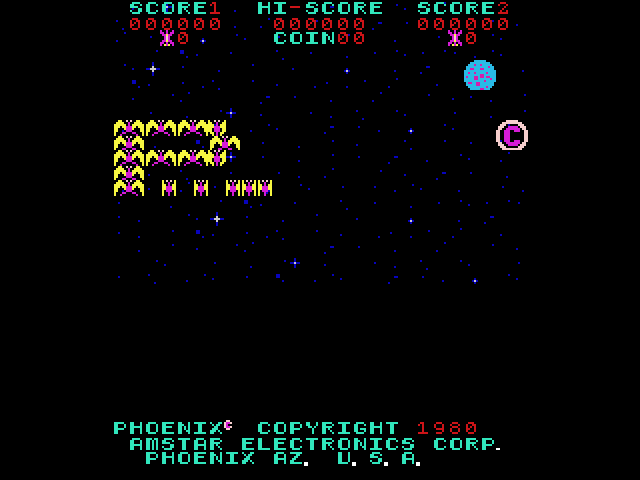
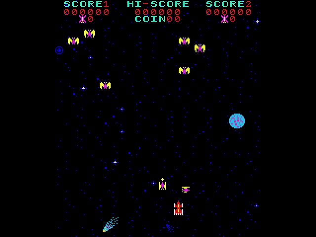
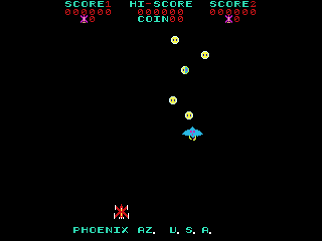
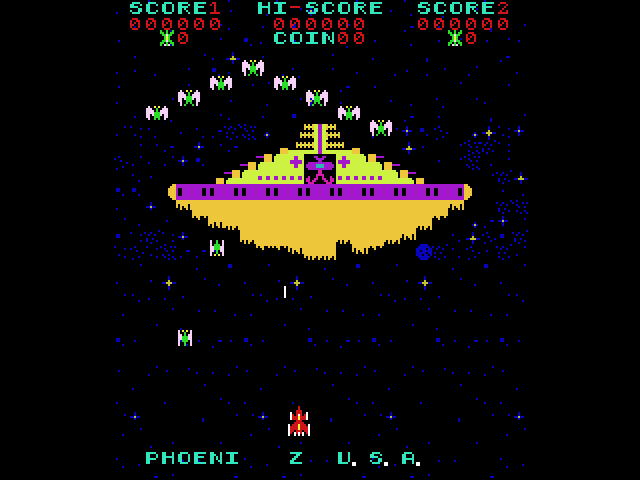
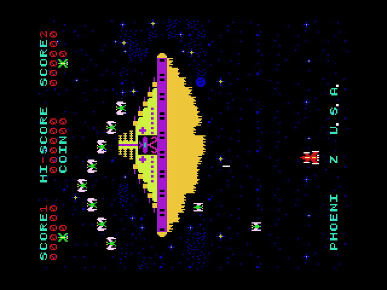
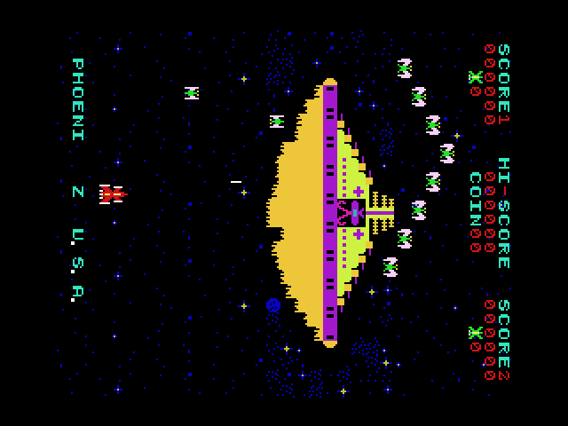

# pico-phoenix

**pico-phoenix** is an emulator of the arcade game **Phoenix** (Amstar, 1980) for RP2350-based microcontroller boards, with video and audio over DVI/HDMI. It emulates the original board: the Intel 8085 CPU, the two tile layers, the colour PROMs, and the sound board with its discrete effect circuits and MM6221AA melody chip. The emulation is a port of the Phoenix driver of [MAME](https://www.mamedev.org/).

It uses the same menu, display, audio and controller framework as this family of emulators:

- NES: [pico-infonesPlus](https://github.com/PicoPlus-devel/pico-infonesPlus)
- Super Nintendo: [pico-snesPlus](https://github.com/PicoPlus-devel/pico-snesPlus)
- Sega Master System / Game Gear: [pico-smsplus](https://github.com/PicoPlus-devel/pico-smsplus)
- Game Boy / Game Boy Color: [pico-peanutGB](https://github.com/PicoPlus-devel/pico-peanutGB)
- Sega Mega Drive / Genesis: [pico-genesisPlus](https://github.com/PicoPlus-devel/pico-genesisPlus)
- OutRun: [pico-outrun](https://github.com/PicoPlus-devel/pico-outrun)

pico-phoenix runs standalone, or as an application of [pico-bootLoader](https://github.com/PicoPlus-devel/pico-bootLoader), where it appears in the **Arcade** category.

**The Phoenix ROM set is not included and must be supplied by the user.** It is copyright Amstar Electronics and is not distributed with this project. See [Game data](#game-data).

***

## Screenshots

The attract mode as the emulator draws it, at twice the original size, with *Tate mode* off. For the two tate orientations, see [Display and tate mode](#display-and-tate-mode).

<table>
  <tr>
    <td></td>
    <td></td>
  </tr>
  <tr>
    <td align="center">Title screen</td>
    <td align="center">Waves 1 and 2: the birds</td>
  </tr>
  <tr>
    <td></td>
    <td></td>
  </tr>
  <tr>
    <td align="center">Waves 3 and 4: the phoenixes</td>
    <td align="center">Wave 5: the mothership</td>
  </tr>
</table>

***

## Game data

Required is the MAME **`phoenix`** set: Phoenix (Amstar, set 1). It consists of 14 files, about 25 KB in total.

Copy it to the folder **`/roms/arcade/PHOENIX`** on the SD card, in either form:

- **`phoenix.zip` as it is.** Merged, split and non-merged sets all work: in a merged set the clone sets in the subfolders of the archive are ignored.
- **The files, unzipped.** A subfolder `/roms/arcade/PHOENIX/phoenix`, which unzipping commonly produces, is searched as well.

Files are recognised by their size and CRC32, so their names do not matter, and a corrupt or different file is never loaded. The board creates the folder `/roms/arcade/PHOENIX` on first start.

When the set is missing or incomplete, the board shows a screen that names the missing files. **SELECT + START** opens the settings menu from that screen; its *USB drive mode* shows the SD card on a computer, so the ROM set can be copied to it without removing the card. After leaving the menu, the board restarts and looks for the set again.

The ROM sets of the clones (Centuri, Taito, Condor, Falcon, Vautour and others) and of Pleiads are not supported.

***

## Supported hardware

pico-phoenix runs on every RP2350 configuration of this family. It requires neither PSRAM nor HSTX: the emulated board is small enough for the internal SRAM, and both video back-ends are supported. RP2040 boards are not supported.

Development and testing take place on the Adafruit Fruit Jam (HW_CONFIG 8). The other configurations are built from the same source, but have not all been tested on hardware.

| HW_CONFIG | Hardware | Video | Binary |
| --- | --- | --- | --- |
| 1 | Pimoroni Pico DV Demo Base with a Raspberry Pi Pico 2 | PicoDVI | `picoPhoenix_PimoroniDVI_pico2_arm.uf2` |
| 2 | Adafruit DVI Breakout and microSD breakout with a Raspberry Pi Pico 2, or the PicoNES PCB | HSTX | `picoPhoenix_AdafruitDVISD_pico2_arm.uf2` |
| 5 | Adafruit Metro RP2350 | HSTX | `picoPhoenix_AdafruitMetroRP2350_arm.uf2` |
| 6 | Waveshare RP2350-Zero with custom PCB | PicoDVI | `picoPhoenix_WaveShareRP2350ZeroWithPCB_arm.uf2` |
| 7 | Waveshare RP2350-PiZero | PicoDVI | `picoPhoenix_WaveShareRP2350PiZero_arm_piousb.uf2` |
| 8 | Adafruit Fruit Jam | HSTX | `picoPhoenix_AdafruitFruitJam_arm_piousb.uf2` |
| 9 | Waveshare RP2350-USB-A | PicoDVI | `picoPhoenix_WaveShare2350USBA_arm_piousb.uf2` |
| 10 | Spotpear HDMI with a Raspberry Pi Pico 2 | PicoDVI | `picoPhoenix_SpotpearHDMI_pico2_arm.uf2` |
| 12 | Murmulator M1 with a Raspberry Pi Pico 2 | PicoDVI | `picoPhoenix_MurmulatorM1_pico2_arm.uf2` |
| 13 | Murmulator M2 | HSTX | `picoPhoenix_MurmulatorM2_arm.uf2` |
| 14 | Adafruit Feather RP2350 with HSTX Port and TLV320DAC3100 I2S DAC | HSTX | `picoPhoenix_AdafruitFeatherRP2350_TLV320DAC3100_arm_piousb.uf2` |
| 15 | Olimex RP2040-PICO-PC with a Raspberry Pi Pico 2 | HSTX | `picoPhoenix_OlimexPicoPC_arm.uf2` |

For wiring and assembly instructions, see the setup sections of the [pico-infonesPlus README](https://github.com/PicoPlus-devel/pico-infonesPlus#setup). To flash a board, hold BOOTSEL while connecting it over USB, then copy the `.uf2` file onto the USB drive that appears.

Audio is sent over HDMI. Boards with an I2S DAC (configurations 1, 8, 12, 13 and 14) can use it instead through the *External Audio* setting; on the Fruit Jam, plugging in headphones selects it automatically. Configuration 15 also plays the sound on its PWM audio jack.

***

## Controls

Phoenix has a two-way joystick and two buttons. Two players take turns on the same controls.

| Controller | Phoenix |
| --- | --- |
| D-pad left / right | Move the ship |
| A (or X) | Fire |
| B (or Y) | Shield |
| SELECT | Insert a coin (on release) |
| START | 1 player start |
| D-pad up | 2 player start |
| START on a second USB controller | 2 player start |
| START + A | Frame rate display on/off |
| SELECT + START | Settings menu |

USB game controllers, NES and SNES controllers on the GPIO ports and the Wii Classic controller are supported, as in the other emulators of this family. The coin is inserted when SELECT is released, and only when no other button was pressed while it was held, so opening the settings menu does not insert a coin. While START is held, A switches the frame rate display (top left, in the border) on or off instead of firing; the same setting is also in the settings menu.

The game is set to its factory defaults: 3 lives, a bonus ship at 3,000 and 30,000 points, and 1 coin for 1 credit.

***

## Display and tate mode

Phoenix was made for a monitor mounted on its side: the original picture is 208 pixels wide and 256 pixels tall. The *Tate mode* setting chooses how it is shown:

| Tate mode | Picture | For |
| --- | --- | --- |
| Off (default) | Turned upright and shown in the centre of the screen. The 256 lines are fitted into the 240 of the screen by leaving out every sixteenth line, which falls in the blank space between two rows of text. | A normal monitor or TV |
| Bottom left | The original 256 x 208 picture, unrotated and pixel exact. | A monitor turned 90 degrees clockwise, so that its bottom edge is on the left |
| Bottom right | The same picture, rotated by 180 degrees. | A monitor turned 90 degrees counter-clockwise, so that its bottom edge is on the right |

The setting takes effect immediately and is saved with the other settings. The settings menu itself is not rotated.

<table>
  <tr>
    <td></td>
    <td></td>
  </tr>
  <tr>
    <td align="center">Bottom left</td>
    <td align="center">Bottom right</td>
  </tr>
</table>

Both pictures appear upright once the monitor is turned as described in the table above.

***

## Settings menu

**SELECT + START** opens the settings menu during the game. Besides *Tate mode*, it offers the screen mode with or without scanlines, the FPS overlay, audio on/off, rapid fire on A, the external audio output, the Fruit Jam volume and VU meter, *Reset Game*, the controller test, BOOTSEL mode and USB drive mode. When started from pico-bootLoader, it also offers *Return to emulator selection menu*.

The settings are stored on the SD card in `/settings_ARC.dat`, a file shared by all arcade games of this family. The game has no save states, and high scores are not kept after a reset or power cycle.

***

## Building from source

Requirements: the Raspberry Pi Pico SDK (`PICO_SDK_PATH`), Pico-PIO-USB (`PICO_PIO_USB_PATH`) for the configurations that use it, the `arm-none-eabi` toolchain and `picotool`.

```sh
git clone --recursive https://github.com/PicoPlus-devel/pico-phoenix.git
cd pico-phoenix
./bld.sh -c 8 -2        # one configuration: HW_CONFIG 8 (Fruit Jam)
./bld.sh -b -c 8 -2     # the same, built for pico-bootLoader (releases_bl/)
./buildAll.sh           # every supported configuration (releases/)
./bld.sh -h             # all options
```

Every configuration must be built with `-2` (RP2350).

### Host test harness

The emulated board in `phoenix/` is plain C without Pico dependencies, and also builds for Linux:

```sh
hosttest/build.sh
./hosttest/phx_host ~/roms/arcade/PHOENIX 3600 300 hosttest/out --coin 200 --start 260 --play 330 --wav hosttest/out/game.wav
python3 hosttest/ppm2png.py hosttest/out/frame_00600.ppm
```

`phx_host` loads the ROM set through the same loader as the firmware, runs the given number of frames with scripted input, writes every Nth frame as a 320 x 240 PPM in the chosen orientation (`--tate 0|1|2`) and the sound as a WAV file. `cpm_host` runs the CP/M CPU test programs (for example `8080EXM.COM`) on the 8085 core.

***

## Credits and licence

- Phoenix driver, video and sound emulation: the MAME project, by Richard Davies, Juergen Buchmueller and Derrick Renaud. 8085 CPU core and MM6221AA melody generator: Juergen Buchmueller and others. Discrete sound modules: K. Wilkins and Derrick Renaud. These parts are under the BSD-3-Clause licence; see [phoenix/LICENSE](phoenix/LICENSE).
- miniz (inflate and CRC32): Rich Geldreich and others; see the licence text in [third_party/miniz/miniz.c](third_party/miniz/miniz.c).
- Framework, menu, display, audio and controller support: [pico_shared](https://github.com/PicoPlus-devel/pico_shared) and the sister projects listed above.

pico-phoenix is distributed under the GNU General Public License v3.0; see [LICENSE](LICENSE).

Phoenix is copyright 1980 Amstar Electronics. This project is not affiliated with Amstar or with the MAME project.
